# Download data from GISAID

## Table of Contents
* [Accessing GSAID](#accessing-gsaid)
* [Global samples](#global-samples)
* [Asia samples](#asia-samples)
* [Philippines samples](#philippines-samples)
* [Mindanao samples](mindanao-samples)

## Accessing GSAID

1. Open the website of [GISAID](https://www.gisaid.org/).

   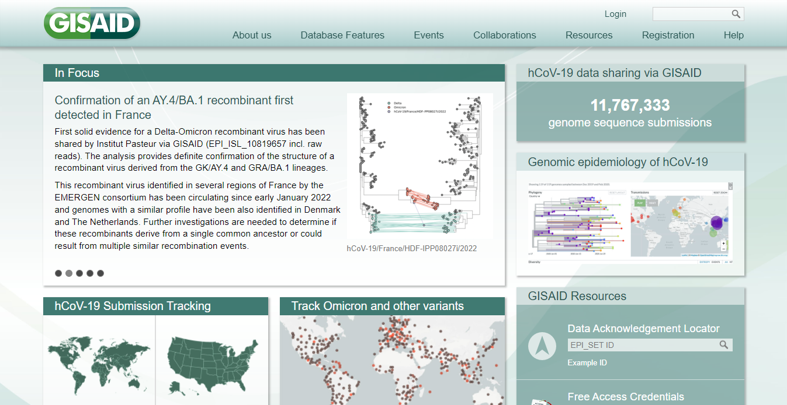

2. On the top right area of the website, click **Login**. Login using the account credentials provided by the supervisor.

   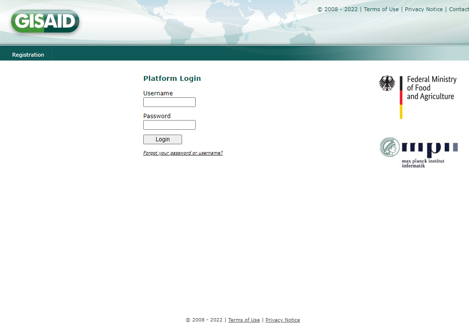

3. On the top panel, click **EpiCoVTM** and click **Downloads**.

   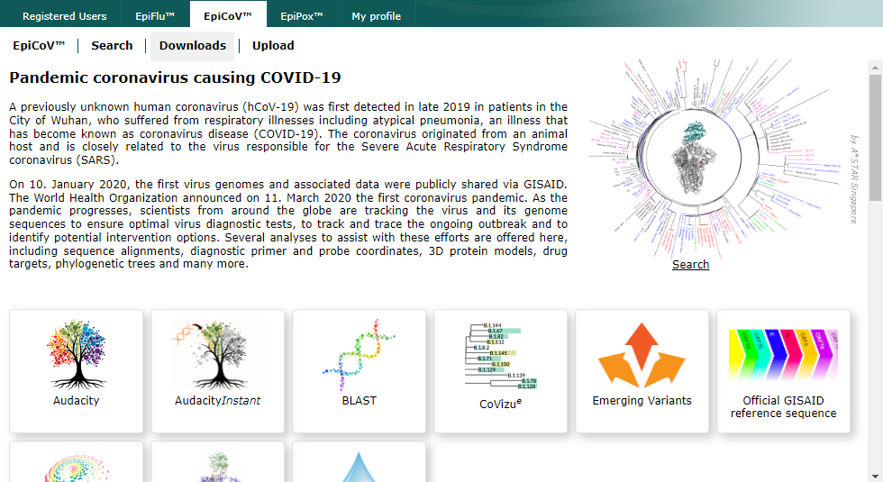

4. Under the Genomic epidemiology, click **nextregions**.

   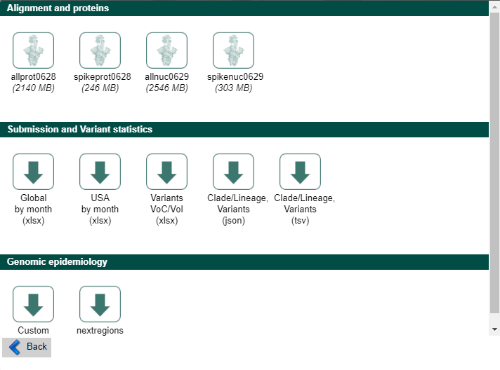

5. A **Region-specific Auspice source files** window will be prompted.

   

## Global Samples

1. Under the **Region-specific Auspice source files** window, click **Global**.

2. Check **I agree to the terms and condition** and click **download**.

   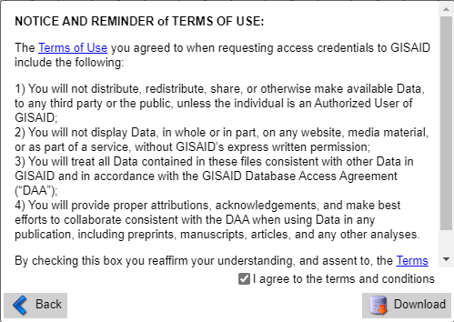

3. Downloading of the Global sequences will start.

## Asia Samples

1.Under the **Region-specific Auspice source files** window, click **Asia**.

2. Check **I agree to the terms and condition** and click **download**.

   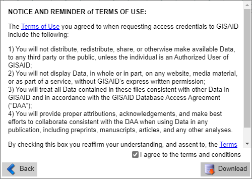

3. Downloading of the Global sequences will start.

## Philippines samples
## Philippines samples

1. Click **Search** on the EpiCov panel and you will be redirected to this page shown below

    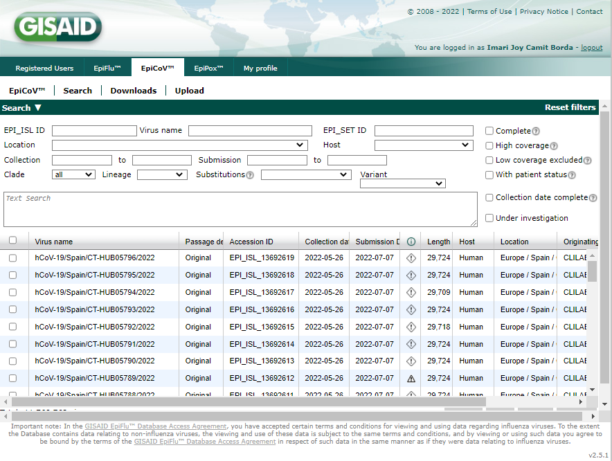

2. Type "**Asia / Philippines**" on the text box as shown below:

   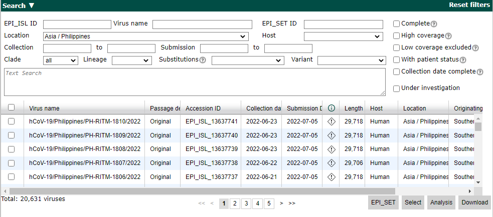

   _NOTE: There is a 5000 per download limit - We need to divide the sets of downloads by collection date._

3. Adjust the collection date manually. Start by changing the date in the **to:** textbox.

   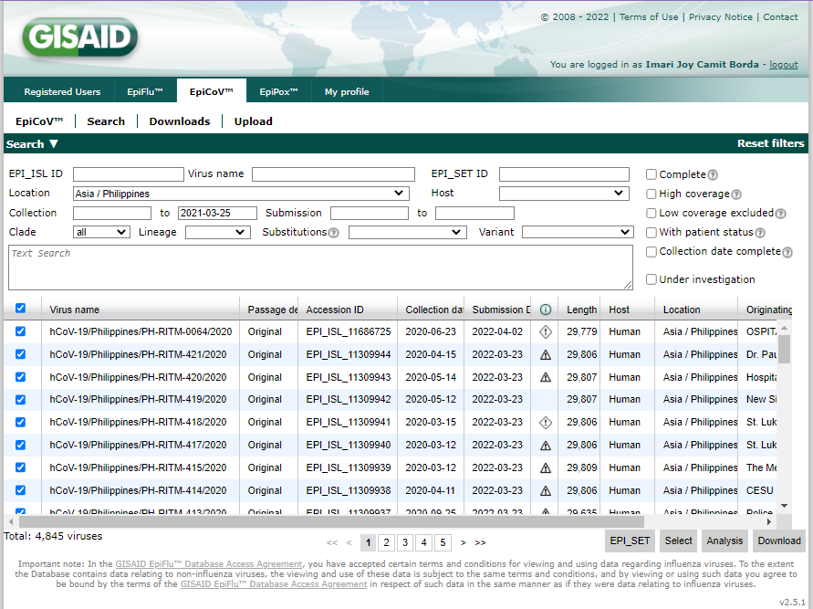

   _NOTE: Don't forget to select all by clicking the checkbox next to the **Virus name**._

4. Check the number of **viruses:** on the bottomleft of the screen. Make sure it is less than 5000, if not, adjust the date as needed.

   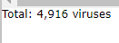

5. Click download on the bottom left of the screen and it will show you this:

   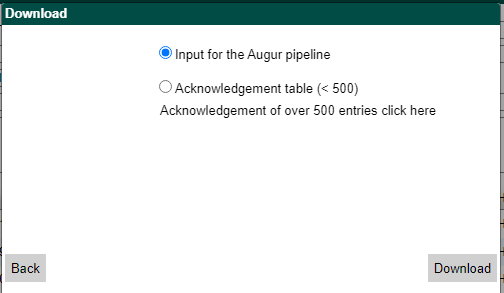
   
   _NOTE: Use input for augur pipeline before clicking download again._

6. Repeat  **steps 2-4** but enter the recent date from the **To:** textbox to the **Collection:** textbox to ensure all samples are covered. Example:

   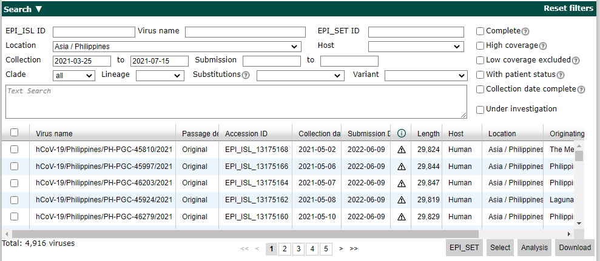
   

## Mindanao samples
