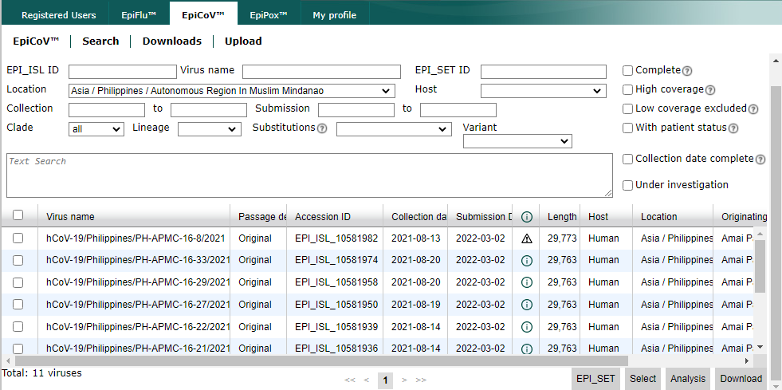
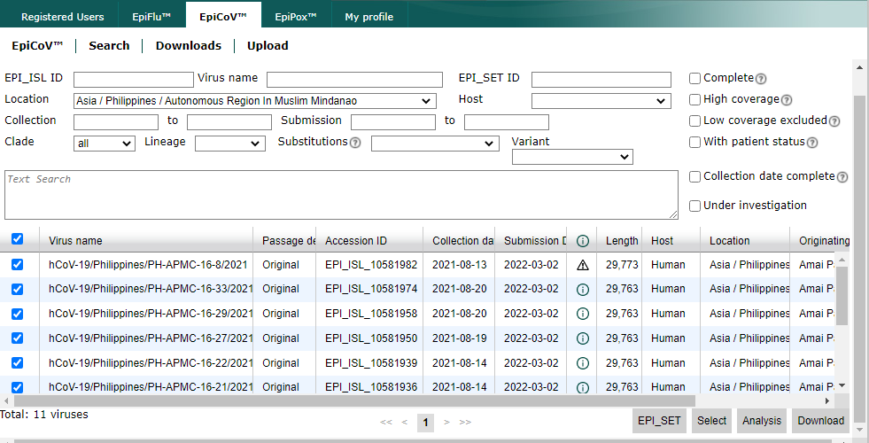

# Download data from GISAID

## Table of Contents
* [Accessing GSAID](#accessing-gsaid)
* [Global samples](#global-samples)
* [Asia samples](#asia-samples)
* [Philippines samples](#philippines-samples)
* [Mindanao samples](#mindanao-samples)

## Accessing GSAID

1. Open the website of [GISAID](https://www.gisaid.org/).

   

2. On the top right area of the website, click **Login**. Login using the account credentials provided by the supervisor.

   

3. On the top panel, click **EpiCoVTM** and click **Downloads**.

   

4. Under the Genomic epidemiology, click **nextregions**.

   

5. A **Region-specific Auspice source files** window will be prompted.

   

## Global Samples

1. Under the **Region-specific Auspice source files** window, click **Global**.

2. Check **I agree to the terms and condition** and click **download**.

   

3. A file with a `.tar` extension will be downloaded.

## Asia Samples

1.Under the **Region-specific Auspice source files** window, click **Asia**.

2. Check **I agree to the terms and condition** and click **download**.

   

3. A file with a `.tar` extension will be downloaded.

## Philippines samples

1. Click **Search** on the **EpiCoVTM** panel. 

    

2. You will be redirected to this page. Type "**Asia / Philippines**" on the text box as shown below:

   

   _NOTE: There is a 5000 per download limit - Divide the sets of downloads by collection date._

3. Adjust the collection date manually. Start by changing the upper limit date in the **to** textbox. Leave the lower limit date as is.

   

4. On the bottom left of the screen, check the number of **Total viruses** to see if its is less than 5000, if not, adjust the date as needed.

   

5. Select all samples and click **Download** on the bottom right of the screen.

   

   _NOTE: To select all, simply click the checkbox next to the **Virus name**._

6. Click **Download** on the pop-up.

   
   
   _NOTE: Use input for augur pipeline._
   
7. A file with a `.tar` extension will be downloaded.

8. Repeat **steps 3-6** but enter the date from the upper limit to the lower limit and enter another upper limit date.
   
   Example:
   
   
9. Ensure all Philippines samples are downloaded.

## Mindanao samples

### List of Mindanao Samples:

* Set A:
    * Autonomous Region In Muslim Mindanao
    * Autonomous Region In Muslim Mindanao(ARMM)
    * Bangsamoro Autonomous Region in Muslim Mindanao

* Set B:
    * Davao
    * Davao Region
    * Region XI (Davao Region)

* Set C:
    * Region X (Northern Mindanao)
    * Northern Mindanao
    
* Set D:
    * Region XII (Soccsksargen)
    * Soccsksargen

* Set E:
    * Region IX
    * Zamboanga
    * Zamboanga Peninsula
    
_NOTE: There are naming inconsistencies and samples from the same region could have different labels. Download all necessary samples per region._

1. Click **Search** on the **EpiCoVTM** panel. 

    

2. You will be redirected to this page. Type "**Asia / Philippines / [insert region]**" on the text box.

   Example:
   
   
   _NOTE: Refer to the [sample list](#list-of-mindanao-samples) of region names above._
   
3. Select all samples and **Download** on the bottom left of the screen.

   
   
4. Click **Download** on the pop-up.

   
   
   _NOTE: Use input for augur pipeline._

5. A file with a `.tar` extension will be downloaded.

6. Repeat **steps 2-4** until all sets from the [sample list](#list-of-mindanao-samples) are downloaded.
