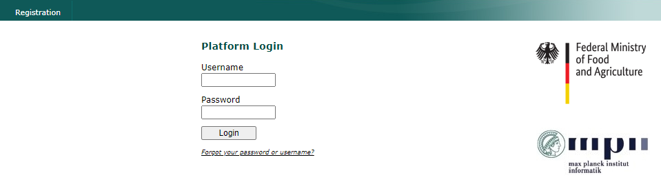

# Download data from GISAID

## Table of Contents
* [Accessing GSAID](#accessing-gsaid)
* [Global samples](#global-samples)
* [Asia samples](#asia-samples)
* [Philippines samples](#philippines-samples)
* [Mindanao samples](mindanao-samples)

## Accessing GSAID

1. Go to the website of gisaid [this is the link](https://www.gisaid.org/)

    

2. Log-in using the gisaid account credentials provided by the adviser.

    

3. Go to EpiCovs panel

    

4. Click downloads 

    

## Global samples

## Asia samples

## Philippines samples

## Mindanao samples
