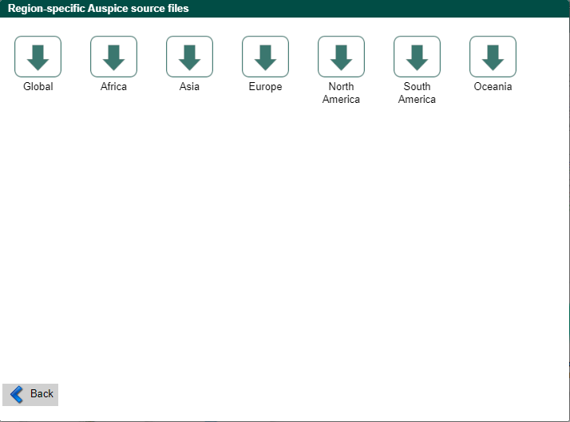

# Download data from GISAID

## Table of Contents
* [Accessing GSAID](#accessing-gsaid)
* [Global samples](#global-samples)
* [Asia samples](#asia-samples)
* [Philippines samples](#philippines-samples)
* [Mindanao samples](mindanao-samples)

## Accessing GSAID

1. Open the website of [GISAID](https://www.gisaid.org/).

   

2. On the top right area of the website, click **Login**. Login using the account credentials provided by the supervisor.

   

3. On the top panel, click **EpiCoVTM** and click **Downloads**.

   

4. Under the Genomic epidemiology, click **nextregions**.

   

5. A **Region-specific Auspice source files** window will be prompted.

   

## Global Samples

1. Under the **Region-specific Auspice source files** window, click **Global**.

2. Check **I agree to the terms and condition** and click **download**.

   

3. Downloading of the Global sequences will start.

## Asia Samples

1.Under the **Region-specific Auspice source files** window, click **Asia**.

2. Check **I agree to the terms and condition** and click **download**.

   

3. Downloading of the Global sequences will start.

## Philippines samples

## Mindanao samples
