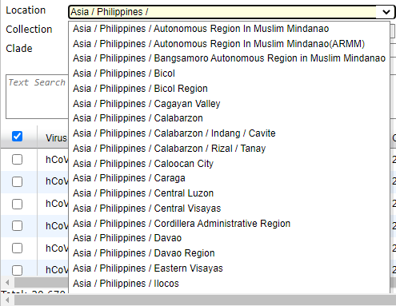
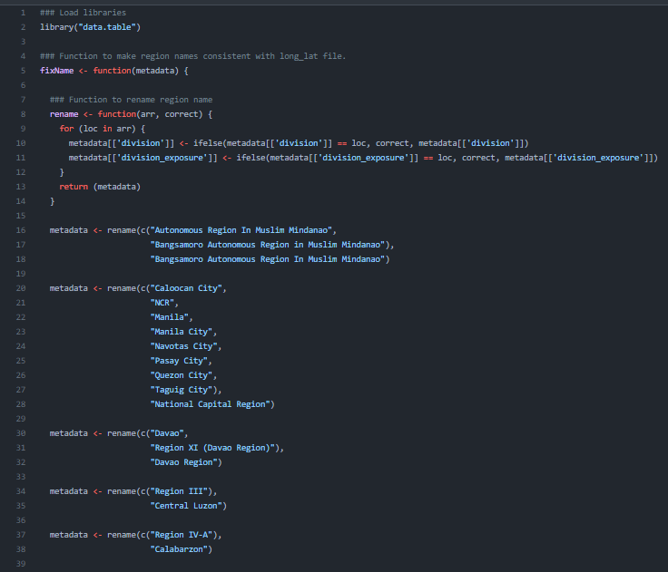

# Fix Known Metadata Issues

## Table of Contents

* [Overview](#overview)
* [Input](#input)
* [Script](#script)
* [Output](#output)
* [Summary of changes](#summary-of-changes)

## Overview

* The metadata contains issues due to the inconsistencies in the region names in **GISAID**.

  Example:

  

* It may cause inconveniences in manipulating the metadata. Therefore, a script is needed to rename the `divisions` or regions to make it consistent.

## Inputs

* Put all the downloaded Mindanao region`.tar` files from **GISAID** in the **input** folder of the **01-fixMetadata** folder.

    ### Expected inputs per region:
    * BARMM:
        *  `something.tar`
    * 
    * `something.tar`
    * `something.tar`

## Script

* To fix the issues, the Rscript from the **01-fixMetadata** folder of the repository will be used. This script normalizes the the region names which merges the data from the same regions.

* It can be accessed through this [link](../../01-fixMetadata/metadataClean.R).

  Here is a preview of the Rscript:

  

### Steps on how to run the script:

1. hdsjdhs
2. dgsudgsudgs
3. dsuhds
4. 

## Output
* 

## Summary of changes

* **Bangsamoro Autonomous Region In Muslim Mindanao**; variants changed:
  * Autonomous Region In Muslim Mindanao
  * Bangsamoro Autonomous Region in Muslim Mindanao

* **Davao region**; variants changed:
    * Davao
    * Region XI (Davao Region)

* **Northern Mindanao**; variants changed:
    * Region X (Northern Mindanao)

* **Soccsksargen**; variants changed:
    * Region XII (Soccsksargen)

* **Zamboanga Peninsula**; variants changed:
    * Region IX
    * Zamboanga

