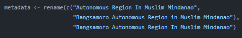

# Fix known metadata issues

## Table of contents
* [Metadata issues](#metadata-issues)
* [Rscript](#rscript)
* [Summary of changes](#summary-of-changes)

## Metadata issues

* The metadata contains issues due to the inconsistencies in the region names in **GISAID**.

  Example:

  

* It may cause inconveniences in manipulating the metadata.

## Rscript
* To fix the issues, the Rscript from the **01-fixMetadata** folder of the repository will be used. It can be accessed through this [link](../../01-fixMetadata/metadataClean.R).

  Here is a preview of the Rscript:

  

* This script normalizes the the region names which merges the data from the same regions.

  Here is a preview of the script that renames the data for **BARMM**:
  
  

## Summary of changes

* **Bangsamoro Autonomous Region In Muslim Mindanao**; variants changed:
  * Autonomous Region In Muslim Mindanao
  * Bangsamoro Autonomous Region in Muslim Mindanao

* **Davao region**; variants changed:
    * Davao
    * Region XI (Davao Region)

* **Northern Mindanao**; variants changed:
    * Region X (Northern Mindanao)

* **Soccsksargen**; variants changed:
    * Region XII (Soccsksargen)

* **Zamboanga Peninsula**; variants changed:
    * Region IX
    * Zamboanga

