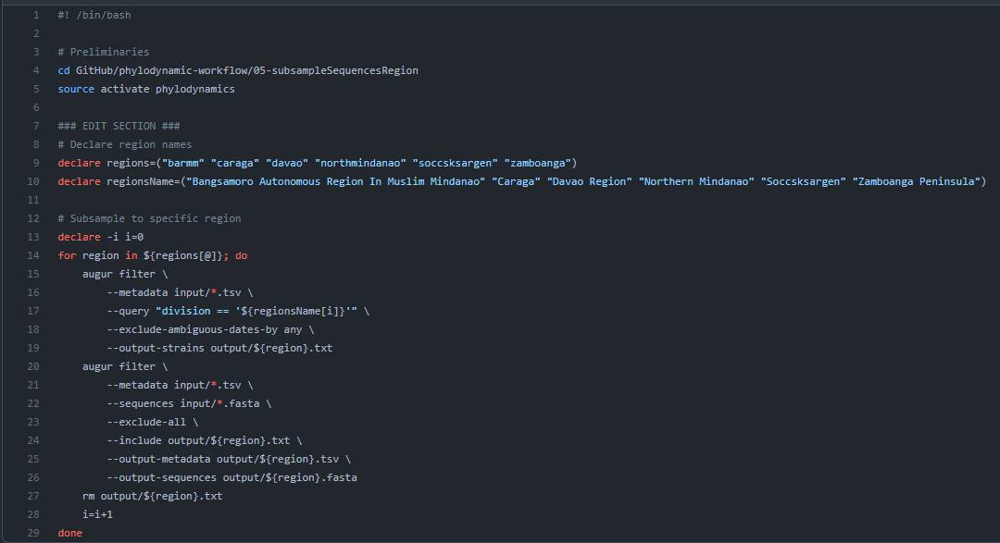

# Subsample Sequences in Mindanao Regions

## Table of Contents

- [Overview](#overview)
- [Inputs](#inputs)
- [Script](#script)
- [Output](#output)

## Overview

- After combining the Mindanao sequences, it becomes more convenient to subsample each region.
- There is a need for subsampling the files because each region must be analyzed separately.

## Inputs
- The resulting `.fasta` and `.tsv` files with the extension inside the **output** folder of the **02-combineSequences** folder of the repository will serve as the input here.

* Put the corresponding files in the **input** folder of the **05-subsampleSequencesRegion** folder in the repository.

  ### Expected files to input:
  - `combineSequences.fasta`
  - `combineSequences.tsv`

## Script
- Use this [script](../../05-subsampleSequencesRegion/subsampleSequencesRegion.command) from the `05-subsampleSequencesRegion` folder in the repository.

  - This script subsamples sequences into individual Mindanao regions
  - Here is a review of the script:

    

### Steps in running the script:
1. Open command prompt.
2. For MacOS users, execute the `.command` file.
3. For Windows users, execute the `.bat` file.

## Outputs
* These files should be found on the **output** folder of the **05-subsampleSequencesRegion** folder.

### Expected outputs:
- Sequence files:
  - `barmm.fasta`
  - `caraga.fasta`
  - `davao.fasta`
  - `northernmindanao.fasta`
  - `soccsksargen.fasta`
  - `zamboanga.fasta`

- Metadata files:
  - `barmm.tsv`
  - `caraga.tsv`
  - `davao.tsv`
  - `northernmindanao.tsv`
  - `soccsksargen.tsv`
  - `zamboanga.tsv`
