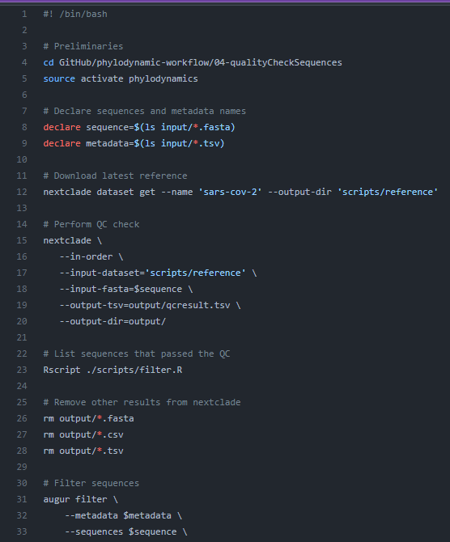

# Quality check samples

## Table of Contents

- [Overview](#overview)
- [Input](#input)
- [Script](#scripts)
- [Output](#output)

## Overview

## Input

- The resulting `.fasta` and `.tsv` files inside the **output** folder of the **05-subsampleSequencesRegion** folder of the repository will serve as the input here.

* Put the corresponding files in the **input** folder of the **04-qualityCheckSequences** folder in the repository.

  ### Expected files to input:

- Sequence files:

  - `barmm.fasta`
  - `caraga.fasta`
  - `davao.fasta`
  - `northernmindanao.fasta`
  - `soccsksargen.fasta`
  - `zamboanga.fasta`

- Metadata files:
  - `barmm.tsv`
  - `caraga.tsv`
  - `davao.tsv`
  - `northernmindanao.tsv`
  - `soccsksargen.tsv`
  - `zamboanga.tsv`

## Scripts

- Use this [script](../../04-qualityCheckSequences/qualityCheckSequences.command) from the `04-qualityCheckSequences` folder in the repository.

  - Performs quality checking on the sequences. Sequences that failed the quality control (QC) test of the Nextclade are dropped from the sequence data (.fasta) and metadata file (.tsv).
  - Here is a review of the script:

    

### Steps on running the script:

1. For **MacOS** users, execute the `.command` file.
2. For **Windows** users, execute the `.bat` file.
3. Do this by simply double clicking on the desired file.
4. A **command prompt** will pop-up, then wait until the script is completely executed.

## Output

- These files should now be found on the **output** folder of the **04-qualityCheckSequences** folder.

### Expected outputs:

- Sequence files:

  - `barmm.fasta`
  - `caraga.fasta`
  - `davao.fasta`
  - `northernmindanao.fasta`
  - `soccsksargen.fasta`
  - `zamboanga.fasta`

- Metadata files:
  - `barmm.tsv`
  - `caraga.tsv`
  - `davao.tsv`
  - `northernmindanao.tsv`
  - `soccsksargen.tsv`
  - `zamboanga.tsv`
